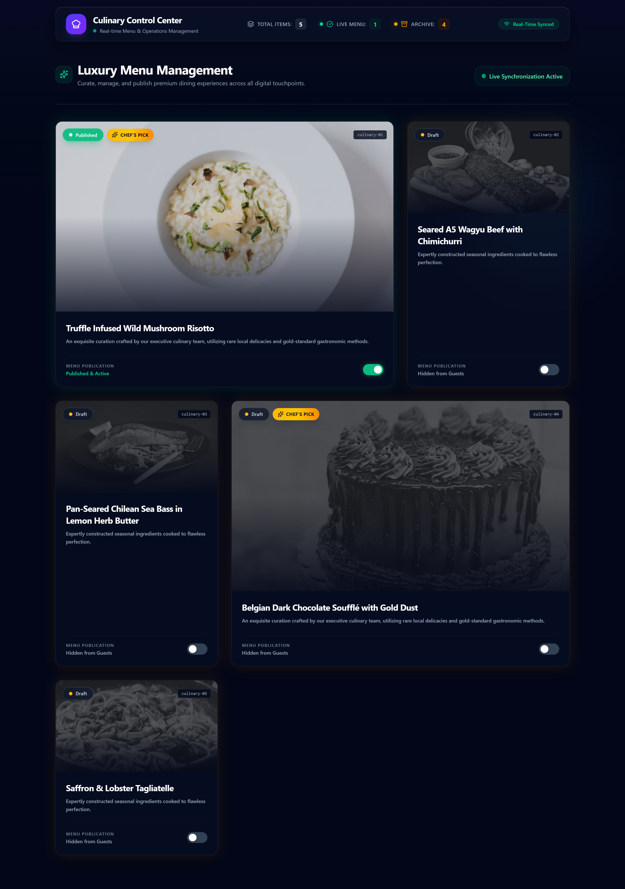
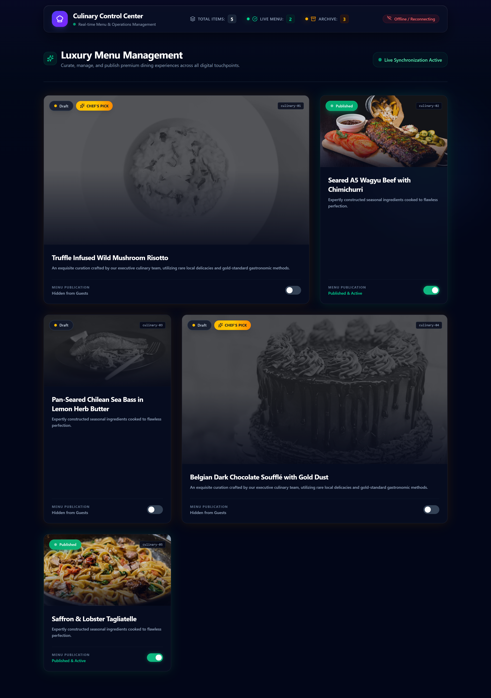

# Culinary Control Center


> A modern, real-time restaurant menu management dashboard built with **React**, **Node.js**, **Express**, **Socket.IO**, and **Tailwind CSS**. Designed for restaurant administrators to publish, archive, and manage dishes with instant synchronization across connected clients.

## Overview

Culinary Control Center is a premium restaurant administration dashboard that enables real-time menu management. Administrators can instantly publish or archive dishes while all connected clients receive updates via WebSockets, creating a seamless and responsive experience.

The interface features an immersive glassmorphism design, animated components, and a modern user experience inspired by premium SaaS dashboard's.

---

## Features

* Real-time synchronization using Socket.IO
* Publish or archive menu items instantly
* Premium glassmorphism UI
* Smooth Framer Motion animations
* Fully responsive dark dashboard
* Live dashboard metrics
* Connection status indicator
* Interactive ambient mouse glow
* Mobile-friendly responsive layout
* Optimistic UI updates
* Error handling and automatic state recovery
* Dynamic dish image rendering

---

## Tech Stack

### Frontend

* React
* Vite
* Tailwind CSS
* Framer Motion
* Socket.IO Client
* Lucide React

### Backend

* Node.js
* Express.js
* Socket.IO

### Data

* JSON-based storage
* REST API
* WebSocket Events

---

## Project Structure

```
dish-dashboard-solution/
│
├── backend/
│   ├── server.js
│   ├── routes/
│   ├── sockets/
│   └── controllers/
│
├── frontend/
│   ├── src/
│   │   ├── App.jsx
│   │   ├── index.css
│   │   └── components/
│   └── public/
│
├── data/
│   └── dishes.json
│
└── README.md
```

---

## Installation

Clone the repository

```bash
git clone https://github.com/yourusername/dish-dashboard-solution.git
```

Navigate into the project

```bash
cd dish-dashboard-solution
```

---

### Install Backend Dependencies

```bash
cd backend
npm install
```

---

### Install Frontend Dependencies

```bash
cd ../frontend
npm install
```

---

## Run the Application

### Start Backend

```bash
cd backend
npm start
```

Backend runs on

```
http://localhost:3001
```

---

### Start Frontend

```bash
cd frontend
npm run dev
```

Frontend runs on

```
http://localhost:5173
```

---

## Real-Time Workflow

```
Dashboard
     │
     ▼
Toggle Dish Status
     │
     ▼
REST API Request
     │
     ▼
Backend Updates JSON
     │
     ▼
Socket.IO Broadcast
     │
     ▼
Connected Clients Instantly Updated
```

---

## Dashboard Includes

* Total Dishes
* Published Menu Count
* Archived Menu Count
* Real-Time Connection Status
* Live Synchronization Indicator
* Featured Menu Cards
* Publication Toggle Switches

---

## UI Highlights

* Premium glassmorphism effects
* Floating ambient lighting
* Animated status indicators
* Smooth hover interactions
* Responsive grid layout
* Soft neon glow animations
* Interactive dashboard cards
* Elegant typography

---

## Preview

> Add screenshots here

```
screenshots/
├── dashboard.png
├── live-sync.png
└── mobile-view.png
```
## Application Preview

### Dashboard



---

### Backend Connection Status

Demonstrates automatic offline detection and reconnection handling when the backend server becomes unavailable.



---

### Responsive Mobile View

Optimized layout for mobile and tablet devices.


---

## Future Improvements

* Authentication & Role-Based Access
* MongoDB Integration
* PostgreSQL Support
* Admin Analytics Dashboard
* Search & Filters
* Categories Management
* Image Upload Support
* Cloud Deployment
* Docker Support
* CI/CD Pipeline
* Unit & Integration Testing

---

## Contributing

Contributions are welcome!

1. Fork the repository
2. Create a feature branch

```bash
git checkout -b feature/new-feature
```

3. Commit your changes

```bash
git commit -m "Add new feature"
```

4. Push your branch

```bash
git push origin feature/new-feature
```

5. Open a Pull Request

---

## 📄 License

This project is licensed under the MIT License.

---

## 👨‍💻 Author

**Alen Fredaric Francis**

Software Developer

* React.js
* Node.js
* Express.js
* Tailwind CSS
* JavaScript
* Socket.IO

---

⭐ If you found this project useful, consider giving it a **Star** on GitHub!
